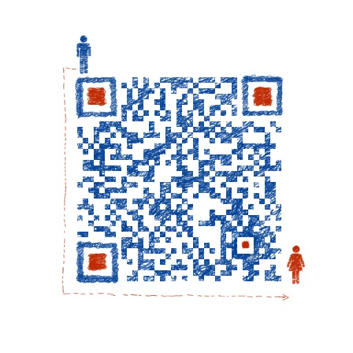

# README

## flutter\_interview

Flutter面试题和答案收集，各种知识点的深入研究，学完之后征服你的面试官。

## 目录

* \*\*\*\*[**Flutter每日一面（面试题一）**](https://github.com/ahyangnb/flutter_interview/issues/1)\*\*\*\*

  > 屏幕适配，isolate通信和原理，热重载原理和过程，Flutter性能，跨平台区别，组件渲染。

* \*\*\*\*[**Flutter每日一面（面试题二）**](https://github.com/ahyangnb/flutter_interview/issues/2)\*\*\*\*

  > Flutter绘制流程，Widget 和 element 和 RenderObject 之间的关系，特殊方法的执行顺序，Future和Isolate区别，Stream订阅模式，await for的使用，Widget、State、Context 的核心概念，key和Navigator。

* \*\*\*\*[**Flutter每日一面（面试题三）**](https://github.com/ahyangnb/flutter_interview/issues/3)\*\*\*\*

  > Dart 语言的特性，Dart 语言重要概念，mixin extends implement 之间关系，mixins的条件，mixin 指定异常类型。

* \*\*\*\*[**Flutter每日一面（面试题四）**](https://github.com/ahyangnb/flutter_interview/issues/4)\*\*\*\*

  > Flutter优缺点以及理念架构，Flutter的FrameWork层和Engine层。
* \*\*\*\*[**Flutter每日一面（面试题五）**](https://github.com/ahyangnb/flutter_interview/issues/5)\*\*\*\*

  > Flutter加载部分。

## Flutter微信群

[上图无法显示点我](http://www.flutterj.com/left_group.png)

Flutter教程网：www.flutterj.com

Flutter交流QQ群：[874592746](https://jq.qq.com/?_wv=1027&k=5coTYqE)

## 公众号

关注公众号“`Flutter前线`”，各种Flutter项目实战经验技巧，干活知识，Flutter面试题答案，等你来领取。

